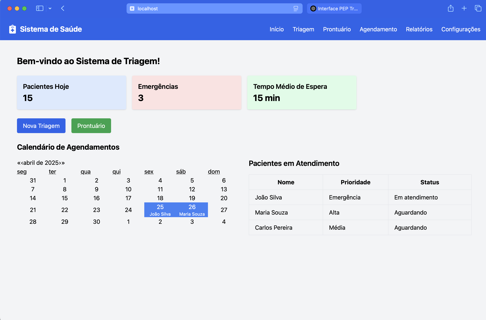

# Sistema de Triagem em Unidade Básica de Saúde

**Projeto desenvolvido para a disciplina de Segurança e Usabilidade em Sistemas de Informação em Saúde - INS310001-41010084MP (20251)**

Este é um projeto simples de triagem em saúde, desenvolvido para fins acadêmicos. O sistema é feito utilizando React, TypeScript e JavaScript, e utiliza dados fictícios para simulação.

## Descrição do Projeto

O Sistema de Triagem em Unidade Básica de Saúde tem como objetivo auxiliar profissionais de saúde no acompanhamento e triagem de pacientes. Ele possui as seguintes funcionalidades:
- Exibição de pacientes em atendimento
- Visualização de agendamentos e calendários
- Interface de triagem para novos pacientes
- Relatórios e acesso ao prontuário de pacientes

### Funcionalidades

- **Tela Inicial**: Exibe dados sobre os pacientes, como status e prioridade, e permite o acesso a funcionalidades como triagem, prontuário e relatórios.
- **Triagem**: Permite registrar novos pacientes com dados de triagem.
- **Calendário de Agendamentos**: Mostra os agendamentos para os próximos dias, com a capacidade de visualizar detalhes das consultas agendadas.


## Página Inicial (Home)

A página inicial do sistema exibe informações importantes sobre os pacientes e o status da triagem. Ela é composta por:

- **Cartões de Dashboard**: Mostra informações sobre o número de pacientes atendidos hoje, emergências, e tempo médio de espera.
- **Lista de Pacientes em Atendimento**: Exibe uma tabela com os pacientes que estão sendo atendidos, incluindo nome, prioridade e status.
- **Links de Atalho**: Facilita o acesso às páginas de triagem e prontuário.

### Exemplo de Tela



## Tecnologias Usadas

- **React** (com TypeScript)
- **JavaScript** (para dados falsos e interação)
- **TailwindCSS** (para a estilização da interface)
- **react-calendar** (para o calendário de agendamentos)

## Como Rodar o Projeto Localmente

1. Clone o repositório:
   ```bash
   git clone https://github.com/your-username/sistema-triagem-saude.git
